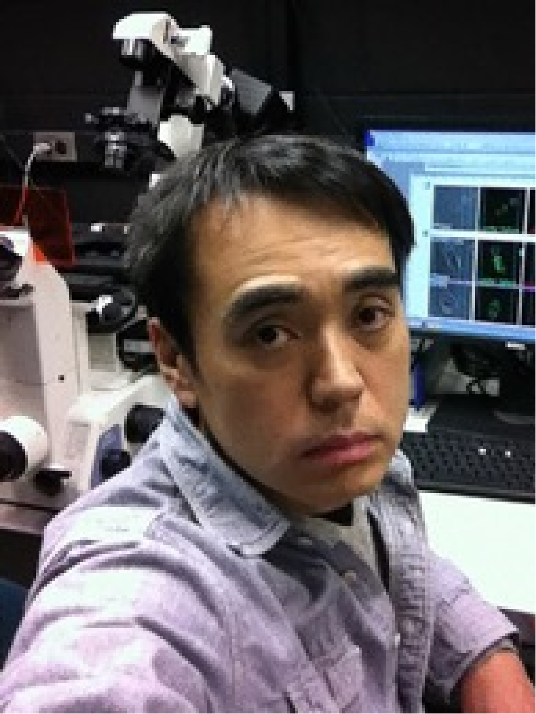
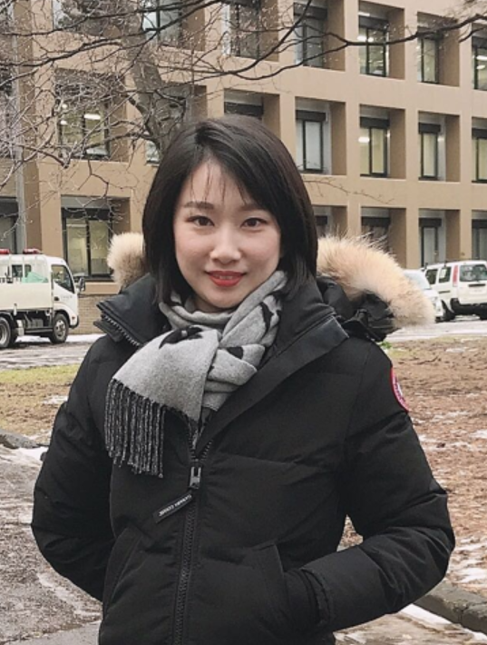
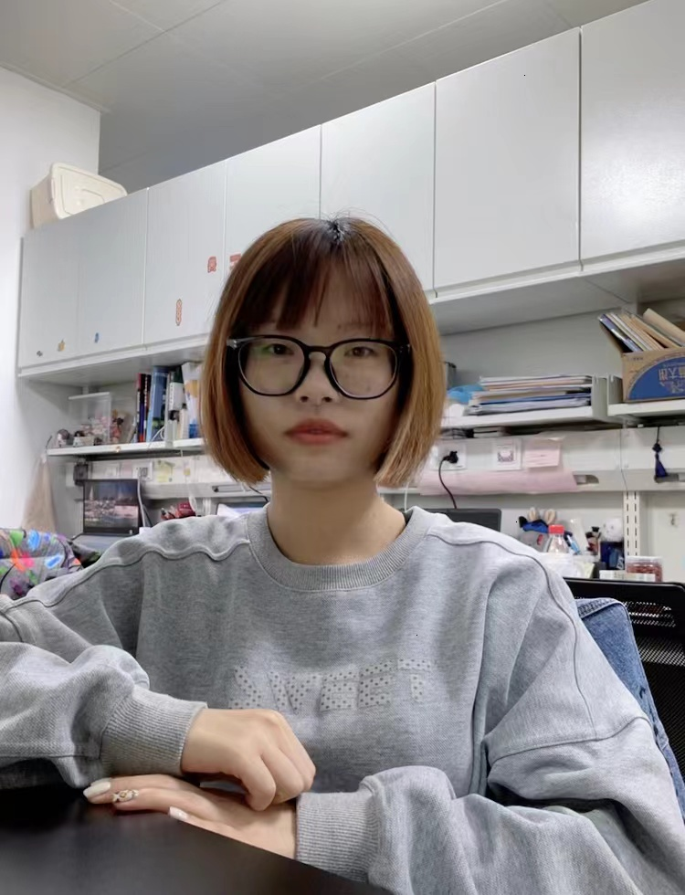
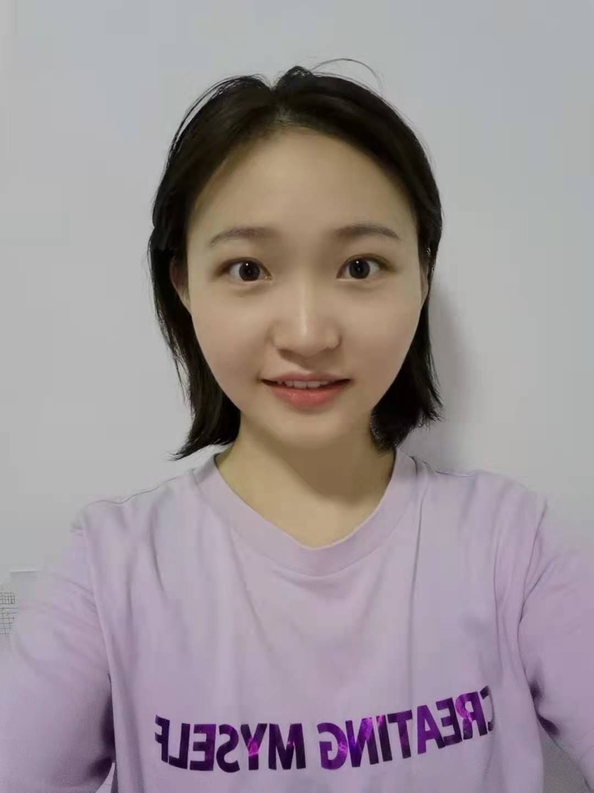
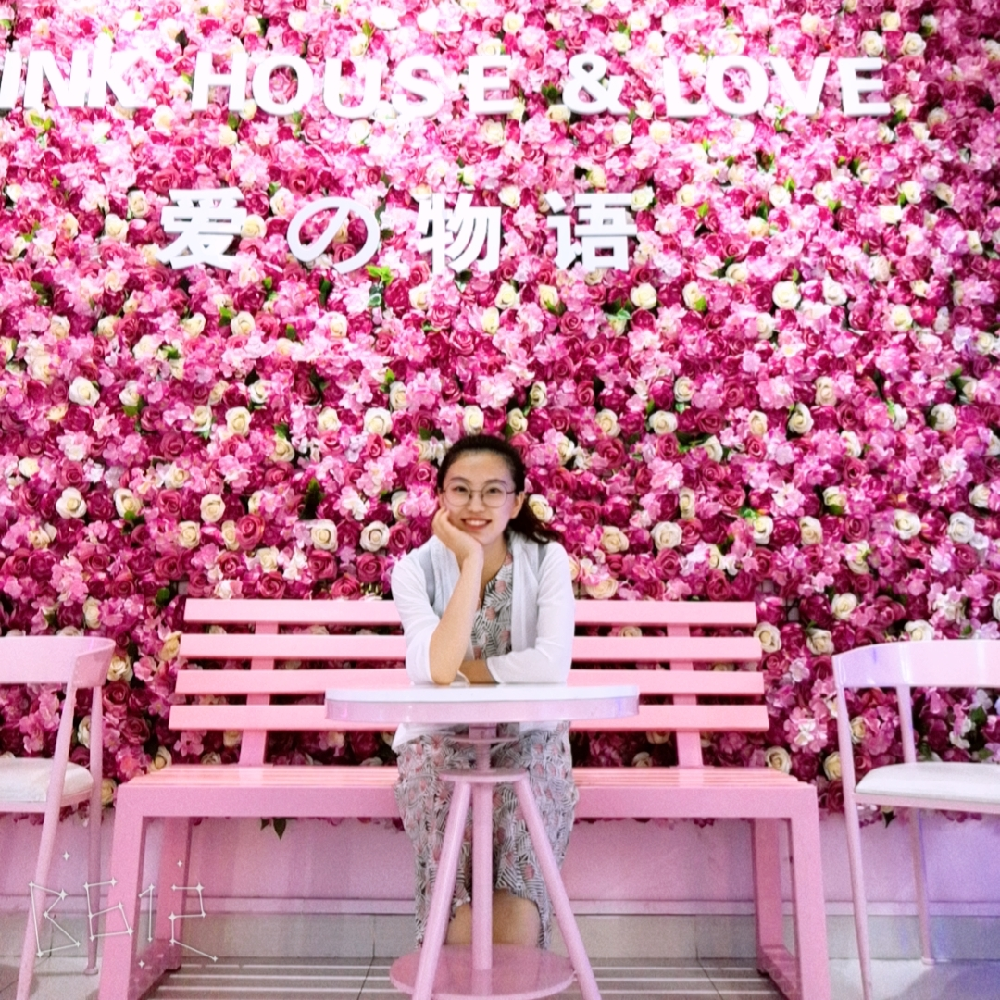
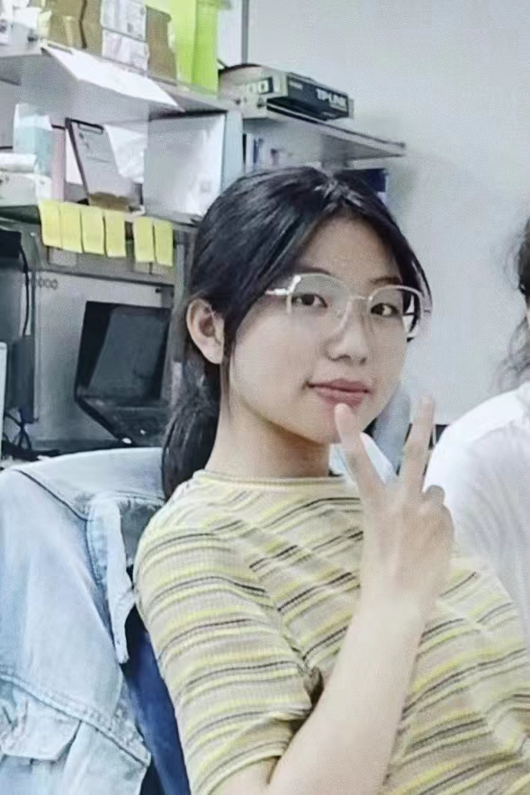
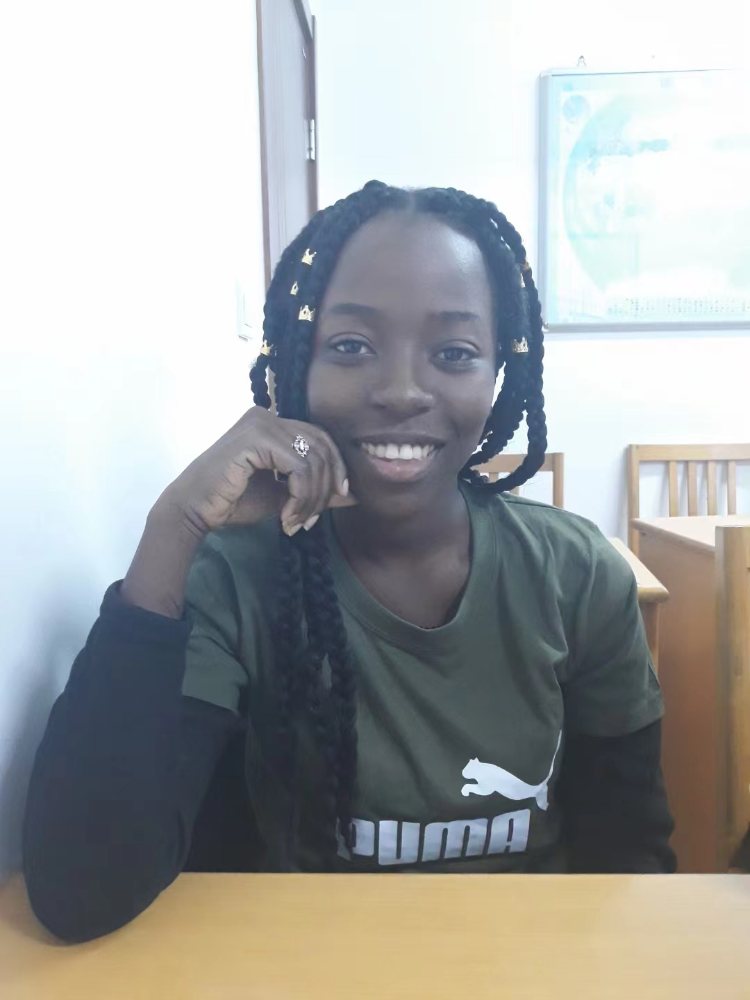

<table border= "1px">
     <tr align="left">
        <td style="font-size:20px" colspan="2" width="265">
            <B>PI</B>
          </td>
    </tr>
    <tr>
        <td width="65">
            
        </td>
        <td style="font-size:18px" width="200">
            <B>Sei Yoshida（吉田 整）</B> 
            <a href="" title="mail">seiyoshi"at"nankai.edu.cn</a> 
            <a href="https://www.researchgate.net/profile/Sei_Yoshida" title="Research Gate Page" target="_blank">Research Gate</a> 
            I received my Ph.D. from the University of Tokyo, Japan, in 2002, then moved to the University of Michigan, the USA in 2006. After 14-year research experience in the US, I have started my lab at Nankai University, Tianjin, China in 2020. 
        </td>
    </tr >
     <tr align="left">
        <td style="font-size:20px" colspan="2" width="265">
            <B>Ph.D Student</B>
          </td>
     </tr>
    <tr>
        <td width="85">
            
        </td>
        <td style="font-size:18px" width="200">
            <B>Xiaowei Sun（孙晓薇）</B> 
            <a href="" title="mail">sunxiaowei"at"mail.nankai.edu.cn</a> 
            2019 Master of Medicine in Clinical Medicine Tianjin Medical University 07/2018-06/2019 Visiting Student in University of Michigan 08/2010-08/2015 Resident Physician PLA No.254 Hospital 
        </td>
    </tr>
     <tr>
        <td width="85">
            
        </td>
        <td style="font-size:18px" width="200">
            <B>Li Wang（王丽）</B> 
            <a href="" title="mail">Wangli2855526698"at"163.com</a> 
            2018.9-2021.6, Master, school of life science in Tianjin University 
        </td>
    </tr>
     <tr>
        <td width="85">
            
        </td>
        <td style="font-size:18px" width="200">
            <B>Yanan Li（李亚男）</B> 
            <a href="" title="mail">lynguilai"at"163.com</a> 
            2019.9-2022.6, Master, school of life science in Nankai University 
        </td>
    </tr>
     <tr align="left">
        <td style="font-size:20px" colspan="2" width="265">
            <B>Master Degree Student</B>
          </td>
     </tr>
    <tr>
        <td width="65">
            
        </td>
        <td style="font-size:18px" width="200">
            <B>Yujie Liu（刘雨洁）</B> 
            <a href="" title="mail">1207154097"at"qq.com</a> 
            Master Degree Student. 
        </td>     
    </tr>
     <tr>
        <td width="65">
            
        </td>
        <td style="font-size:18px" width="200">
            <B>Jinzi Wei（韦金孜）</B> 
            <a href="" title="mail">weijinzi"at"mail.nankai.edu.cn</a> 
            Master Degree Student. 
        </td>     
    </tr>
          <tr>
        <td width="65">
            
        </td>
        <td style="font-size:18px" width="200">
            <B>Yuxin He（何雨欣）</B> 
            <a href="" title="mail">heyx99986“at“163.com</a> 
            Master Degree Student. 
        </td>   
    </tr >
     <tr align="left">
        <td style="font-size:20px" colspan="2" width="265">
            <B>Undergraduate Student</B>
          </td>           
    </tr>
     <tr>
        <td width="65">
            
        </td>
        <td style="font-size:18px" width="200">
            <B>Liangci Zhang（张亮辞）</B> 
            <a href="" title="mail">2013495“at“mail.nankai.edu.cn</a> 
            Undergraduate of Nankai University. 
              </td> 
    </tr>
     <tr>
        <td width="65">
            
        </td>
        <td style="font-size:18px" width="200">
            <B>Kofi Gyfiënsa（科菲）</B> 
            <a href="" title="mail">shashakofisk@gmail.com</a> 
            Undergraduate of Nankai University. 
              </td> 
     </tr>
     <tr>
        <td width="65">
            
        </td>
        <td style="font-size:18px" width="200">
            <B>杜林轩</B> 
            <a href="" title="mail">3487039176@qq.com</a> 
            Undergraduate of Nankai University. 
              </td> 
    </tr>
    <tr align="left">
        <td style="font-size:20px" colspan="2" width="265">
            <B>Exchange PhD Student</B>
          </td>
     </tr>
    <tr>
        <td width="65">
            
        </td>
        <td style="font-size:18px" width="200">
            <B>Jianan Chen（陈佳男）</B> 
            <a href="" title="mail">asdfch"at"126.com</a> 
            2021.09-2025.06, Ph.D, Medical School of Nankai University 
            2017.09-2020.06, Master, Medical School of Shandong University. 
        </td>
     </tr>
    <tr>
        <td width="65">
            
        </td>
        <td style="font-size:18px" width="200">
            <B>Xinghui Yu（于兴辉) </B> 
            <a href="" title="mail">704316147"at"qq.com</a> 
            2021.09-2025.06,Ph.D,Medical School of Nankai University 
            2014.09-2017.06,Master,Hebei Medical University. 
        </td>
     </tr>
        <tr align="left">
         <td style="font-size:20px" colspan="2" width="265">
             <B>Former Lab Member</B>
           </td>
      </tr>
       <tr>
        <td style="font-size:18px" width="200">
            <B>Lian Li（李莲）</B> 
        </td>
        <td style="font-size:18px" width="200">
             Associate Professor  
             2020.9-2021.6 
        </td> 
     </tr>
       <tr>
        <td style="font-size:18px" width="200">
            <B>Hua Qin（秦华）</B> 
        </td>
        <td style="font-size:18px" width="200">
             Associate Professor  
        </td> 
    </tr>
      <tr>
        <td style="font-size:18px" width="200">
            <B>Wenyue Zheng（郑文悦）</B> 
        </td>
        <td style="font-size:18px" width="200">
            Undergraduate of Nankai University  
            2020.10-2021.5 
        </td>     
    </tr>
    <tr> 
        <td style="font-size:18px" width="200">
            <B>Yixin Zhang（张益鑫）</B>         
         </td>
        <td style="font-size:18px" width="200">
            Undergraduate of Nankai University  
            2020.9-2021.6 
        </td>   
    </tr>
    <tr>
        <td style="font-size:18px" width="200">
            <B>Xiaoyu Zhang（张晓雨）</B>         
         </td>
        <td style="font-size:18px" width="200">
            Student of Tianjin Medical university, majoring in clinical medicine  
            2021.1-2021.8 
        </td>   
    </tr>
    <tr>
        <td style="font-size:18px" width="200">
            <B>Rui Hua（花蕊）</B> 
         </td>
        <td style="font-size:18px" width="200">
            Undergraduate of Nankai University  
            2020.10-2022.6 
        </td>   
    </tr>
    <tr>
        <td style="font-size:18px" width="200">
            <B>Shuheng Zhou（周树恒）</B> 
         </td>
        <td style="font-size:18px" width="200">
            Undergraduate of Nankai University 
            2021.8-2022.6         
    </tr>
    <tr>
    </table>
---
    
