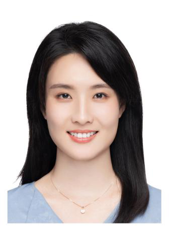
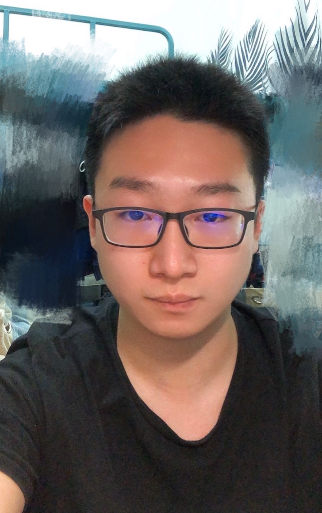
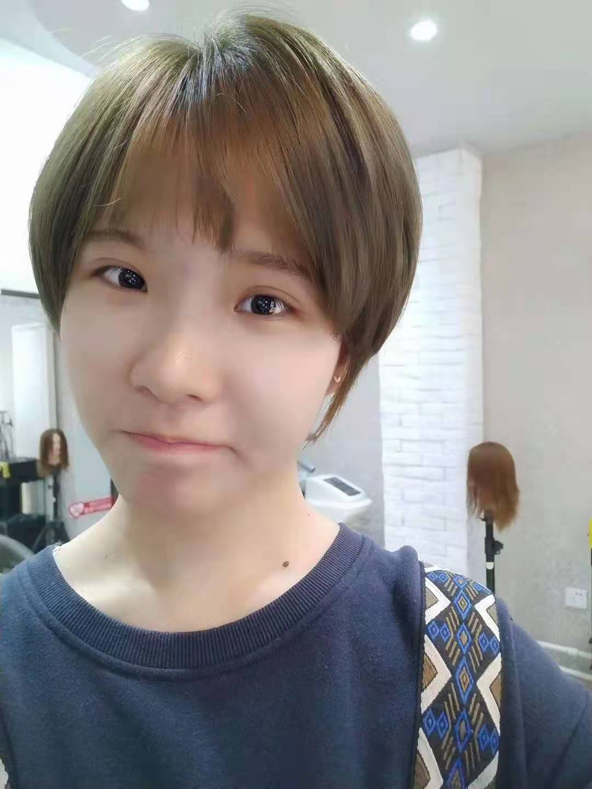

<table border= "1px">
     <tr align="left">
        <td style="font-size:20px" colspan="2" width="265">
            <B>PI</B>
          </td>
    </tr>
    <tr>
        <td width="65">
            
        </td>
        <td style="font-size:18px" width="200">
            <B>Sei Yoshida（吉田 整）</B> 
            <a href="" title="mail">seiyoshi"at"nankai.edu.cn</a> 
            <a href="https://www.researchgate.net/profile/Sei_Yoshida" title="Research Gate Page" target="_blank">Research Gate</a> 
            I received my Ph.D. from the University of Tokyo, Japan, in 2002, then moved to the University of Michigan, the USA in 2006. After 14-year research experience in the US, I have started my lab at Nankai University, Tianjin, China in 2020. 
        </td>
    </tr>
    <tr align="left">
        <td style="font-size:20px" colspan="2" width="265">
            <B>Associate Professor</B>
          </td>
    </tr>
    <tr>
        <td width="65">
            
        </td>
        <td style="font-size:18px" width="200">
            <B>Hua Qin（秦华）</B> 
            <a href="">qinhua"at"nankai.edu.cn</a> 
            Associate Professor in Nankai University. I got my Ph.D. from Tianjin Medical University and then did postdoctoral research in Chinese PLA General Hospital (301 Hospital). I have long been engaged in the scientific research of stem cells, tissue repair, and regeneration, meanwhile, I focus on the usage of small molecules to control the cell fate of somatic cells and investigate their roles in cell reprogramming, transdifferentiation, and in vivo tissue regeneration. As PI, I have undertaken one NSFC grant and other three grants and published SCI papers (in Science Advances, Protein&Cell, and other journals). 
        </td>
    </tr>
     <tr align="left">
        <td style="font-size:20px" colspan="2" width="265">
            <B>Ph.D Student</B>
          </td>
     </tr>
    <tr>
        <td width="85">
            
        </td>
        <td style="font-size:18px" width="200">
            <B>Xiaowei Sun（孙晓薇）</B> 
            <a href="" title="mail">sunxiaowei"at"mail.nankai.edu.cn</a> 
            2019 Master of Medicine in Clinical Medicine Tianjin Medical University 07/2018-06/2019 Visiting Student in University of Michigan 08/2010-08/2015 Resident Physician PLA No.254 Hospital 
        </td>
    </tr>
     <tr>
        <td width="85">
            
        </td>
        <td style="font-size:18px" width="200">
            <B>Li Wang（王丽）</B> 
            <a href="" title="mail">Wangli2855526698"at"163.com</a> 
            2018.9-2021.6, Master, school of life science in Tianjin University 
        </td>
    </tr>
     <tr align="left">
        <td style="font-size:20px" colspan="2" width="265">
            <B>Master Degree Student</B>
          </td>
     </tr>
    <tr>
        <td width="65">
            
        </td>
        <td style="font-size:18px" width="200">
            <B>Yujie Liu（刘雨洁）</B> 
            <a href="" title="mail">1207154097"at"qq.com</a> 
            Master Degree Student. 
        </td>     
    </tr>
     <tr>
        <td width="65">
            
        </td>
        <td style="font-size:18px" width="200">
            <B>Jinzi Wei（韦金孜）</B> 
            <a href="" title="mail">weijinzi2021"at"163.com</a> 
            Master Degree Student. 
        </td>     
    </tr>
    <tr align="left">
        <td style="font-size:20px" colspan="2" width="265">
            <B>Undergraduate</B>
          </td>
     </tr>
    <tr>
        <td width="65">
            
        </td>
        <td style="font-size:18px" width="200">
            <B>Rui Hua（花蕊）</B> 
            <a href="" title="mail">ruihua"at"mail.nankai.edu.cn</a> 
             <a href="https://www.researchgate.net/profile/Rui-Hua" title="Research Gate Page" target="_blank">Research Gate</a> 
            Undergraduate of Nankai University. 
        </td>     
     </tr>
    <tr>
        <td width="65">
            
        </td>
        <td style="font-size:18px" width="200">
            <B>Shuheng Zhou</B> 
             
            Undergraduate of Nankai University. 
        </td>     
    </tr>
       <tr align="left">
        <td style="font-size:20px" colspan="2" width="265">
            <B>Visiting Student</B>
          </td>
     </tr>
    <tr>
        <td width="65">
            
        </td>
        <td style="font-size:18px" width="200">
            <B>Xiaoyu Zhang（张晓雨）</B> 
            <a href="" title="mail">762656889"at"qq.com</a> 
            I'm Zhang Xiaoyu, a student from Tianjin Medical university, majoring in clinical medicine. 
        </td>  
      </tr>
        <tr align="left">
         <td style="font-size:20px" colspan="2" width="265">
             <B>Former Lab Member</B>
           </td>
      </tr>
       <tr>
        <td style="font-size:18px" width="200">
            <B>Lian Li（李莲）</B> 
             Associate Professor 2020.9-2021.6 
        </td> 
    </tr>
      <tr>
        <td style="font-size:18px" width="200">
            <B>Wenyue Zheng（郑文悦）</B> 
            Undergraduate of Nankai University 2020.10-2021.5. 
        </td>     
    </tr>
    <tr>
       
        <td style="font-size:18px" width="200">
            <B>Yixin Zhang（张益鑫）</B> 
            Undergraduate of Nankai University 2020.9-2021.6 
        </td>   
    </tr>
    </table>
---
    
