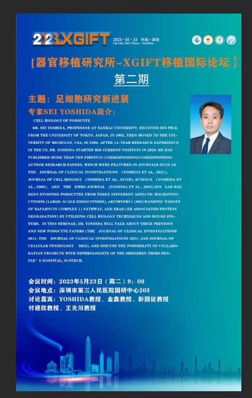
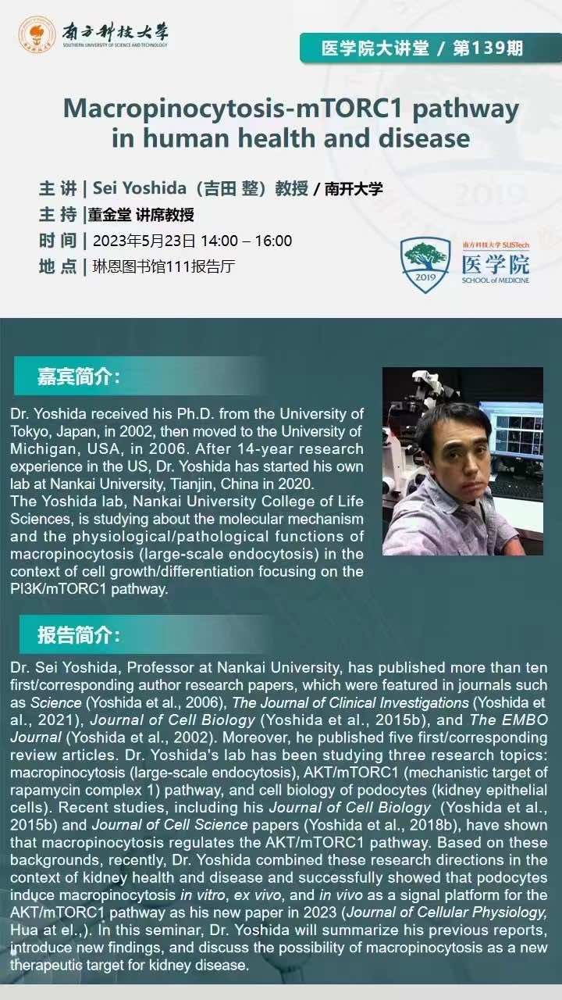

<html>
<head>
<meta name="viewport" content="width=device-width, initial-scale=1">

</head>
<body>
  
<b>2023/May/23th &nbsp;&nbsp; </b>

  
Dr. Yoshida was invited to a research seminars by the Shenzhen Third People's Hospital and the Southern University of Science and Technology on May/23rd. 
 
  
  

    
  
  
<b>2023/May/12th &nbsp;&nbsp; </b>

  
Dr. Yoshida was invited for a research seminar by Shandong Normal University. 
 

   
  
   
<b>2023/Apr/29th &nbsp;&nbsp; </b>

  
Our paper "Identification of circular dorsal ruffles as signal platforms for the AKT pathway in glomerular podocytes" has been published in the Journal of Cellular Physiology. Undergraduate student Rui Hua and Master's student Jinzi Wei are the first authors. Congratulations, Hayley and Jinzi! 
 

   
  
   
<b>2023/Apr/29th &nbsp;&nbsp; </b>

  
Our collaboration paper with Drs. Hong Zheng and Zhong-Yang Shen from the Tianjin First Central Hospital was accepted by the World Journal of Gastroenterology (WJG). 
  

   
  
  
<b>2023/Apr/14th &nbsp;&nbsp; </b>

  
Congratulations to Jinzi for winning the poster award at The 18th Annual Meeting of the Chinese Society of Cell Biology! 
  

   
  
  
<b>2022/Jul/7th &nbsp;&nbsp; New Paper</b>

  
Our paper <b>"Circular dorsal ruffles disturb the growth factor-induced PI3K-AKT pathway in hepatocellular carcinoma Hep3B cells"</b> has been published in <i>Cell Communication and Signaling</i>. Ph.D. student Xiaowei Sun is the first author. 

  
For more information, please check this <a href="https://biosignaling.biomedcentral.com/articles/10.1186/s12964-022-00911-6
" target="_blank">Cell Communication and Signaling </a>. 

   
  
  
<b>2022/May/1th &nbsp;&nbsp; New Paper</b>

  
Our collaboration paper <b>"HIF-1α/FOXO1 axis regulated autophagy is protective for β cell survival under hypoxia in human islets"</b> has been published in <i>Biochim Biophys Acta Mol Basis Dis</i>. Dr. Yoshida is one of the co-corresponding authors. 

  
For more information, please check this <a href="https://www.sciencedirect.com/science/article/pii/S0925443922000199
" target="_blank">Biochim Biophys Acta Mol Basis Dis </a>. 

   
  
  
<b>2021/Sep/7th &nbsp;&nbsp; New Paper</b>

  
Our collaboration paper <b>"Capecitabine Can Induce T Cell Apoptosis: A Potential Immunosuppressive Agent With Anti-Cancer Effect"</b> has been published in <i>Frontiers in Immunology</i>. 

  
For more information, please check this <a href="https://www.frontiersin.org/articles/10.3389/fimmu.2021.737849/full?&utm_source=Email_to_authors_&utm_medium=Email&utm_content=T1_11.5e1_author&utm_campaign=Email_publication&field=&journalName=Frontiers_in_Immunology&id=737849
" target="_blank">Frontiers in Immunology</a>. 

   
  
  
<b>2021/May/26th &nbsp;&nbsp; New Paper</b>

  
Our review <b>Macropinocytosis and SARS CoV-2 Cell Entry</b> was published in <i>Blood and Genomics</i>. 

  
Dr. Yoshida is the corresponding author. phD student Xiaowei Sun and undergraduate Wenyue Zheng are the co-first authors. Lab members Rui Hua, Yujie Liu, Li Wang also contributed to this review. 

  
For more information, please check this <a href="http://www.blood-genomics.com/ch/reader/view_abstract.aspx?file_no=20210101&flag=1" target="_blank">Blood and Genomics</a>. 

   
  
  
<b>2021/May/7th &nbsp;&nbsp; Paper Introduction </b>

  
Our recent paper <b>Endoplasmic reticulum-associated degradation is required for nephrin maturation and kidney glomerular filtration function</b> which was published in <i>The Journal of Clinical Investigation</i> was introduced by <i>Nature Reviews Nephrology</i> and JCI.

<a href="https://www.nature.com/articles/s41581-021-00421-7" title="Introduction" target="_blank">Nature Reviews Nephrology</a>
 

<a href="https://www.jci.org/this-month/2021/5" title="Introduction" target="_blank">The Journal of Clinical Investigation</a>
 

   
  
  
<b>2021/Apr/17th &nbsp;&nbsp; 2021 National Academic Conference of the CSCB </b>

  
From April 14 to April 16, Dr. Sei Yoshida, Xiaowei Sun (Ph.D. student), Rui Hua, and Wenyue Zheng (undergraduate students) attended the 2021 National academic Conference of the Chinese Society of Cell Biology.
 
  
On April 15th, Dr. Sei Yoshida gave a report entitled Macropinocytosis in PI3K-mTORC1 pathway at the meeting.

   
  
  
<b>2021/Apr/1st &nbsp;&nbsp; New Paper</b>

  
Our first paper <b>Endoplasmic reticulum-associated degradation is required for nephrin maturation and kidney glomerular filtration function</b> was published in <i>The Journal of Clinical Investigation</i> as a collaboration with The University of Michigan.
 
  
Dr. Yoshida is the 1st co-first author and a co-corresponding author. Two undergraduates, Wenyue Zheng, and Rui Hua contribute this as co-authors.
 
  
This paper was highlighted as the cover article. For more information, please see the <a href="https://seiyoshida-lab.github.io/publications/" title="Publications" target="_blank">Publications</a>.

   
  
  
<b>2021/Mar/22th &nbsp;&nbsp; Welcome Here</b>

  
Welcome to Dr. Sei Yoshida's Lab Website!

</body>
</html>
