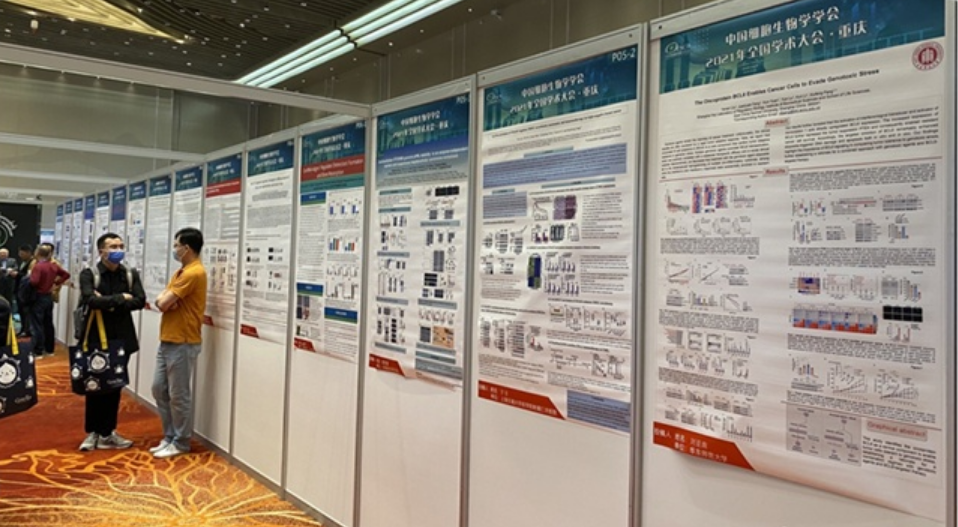

<html>
<head>
<meta name="viewport" content="width=device-width, initial-scale=1">

</head>

<body>
  
<b>2021/Apr/17th &nbsp;&nbsp; 2021 National Academic Conference of the CSCB </b>

  
From April 14 to April 16, Dr. Sei Yoshida, Sun Xiaowei (Ph.D. student), Rui Hua, and Wenyue Zheng (undergraduate students) attended the 2021 National academic Conference of the Chinese Society of Cell Biology.
 
  
On April 15th, Dr. Sei Yoshida gave a report entitled Macropinocytosis in PI3K-mTORC1 pathway at the meeting.

  

   

<b>2021/Apr/1st &nbsp;&nbsp; New Paper</b>

  
Our first paper <b>Endoplasmic reticulum-associated degradation is required for nephrin maturation and kidney glomerular filtration function</b> was published in <i>The Journal of Clinical Investigation</i> as a collaboration with The University of Michigan.
 
  
Dr. Yoshida is the 1st co-first author and a co-corresponding author. Two undergraduates, Wenyue Zheng, and Rui Hua contribute this as co-authors.
 
  
This paper was highlighted as the cover article. For more information, please see the <a href="https://seiyoshida-lab.github.io/publications/" title="Publications" target="_blank">Publications</a>.

   
  
<b>2021/Mar/22th &nbsp;&nbsp; Welcome Here</b>

  
Welcome to Dr. Sei Yoshida's Lab Website!

</body>
</html>

